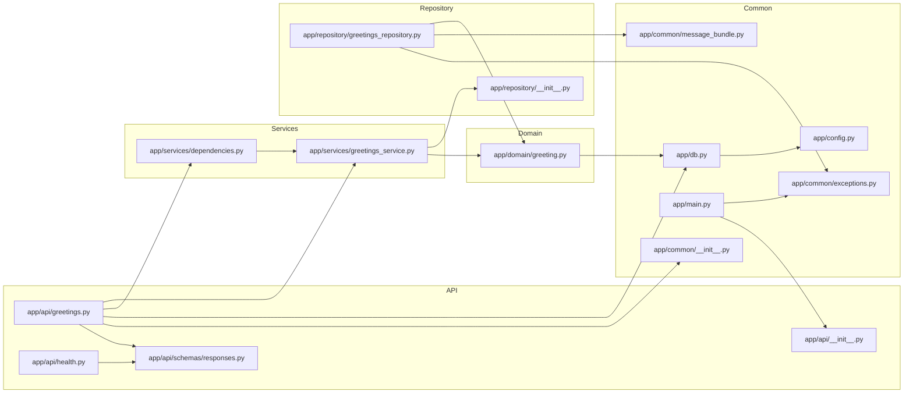
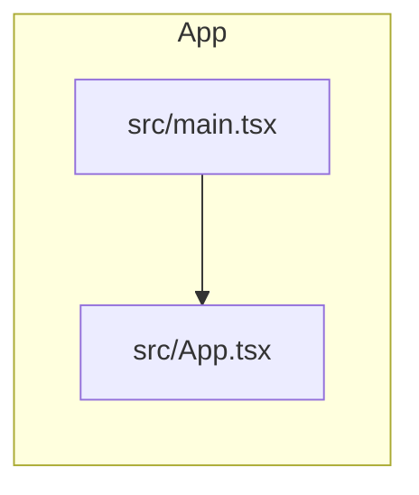

# Allocio Code Map

<!-- Generated by `tools/code_map.py --write-overview` from parsed source. Do not edit by hand. -->

Deterministic architecture overview — a module graph and a symbol outline per area, derived from Python `ast` and the TypeScript compiler. Regenerate with `uv run --python 3.14 python tools/code_map.py --write-overview docs/code-map.md`.

## Backend

### backend/alembic/versions/0001_create_greetings.py

- **fn** `downgrade` · L36–37
- **fn** `upgrade` · L20–33

### backend/app/api/greetings.py

- **route** `GET /greeting` → get_greeting · L26–32
- **fn** `get_greeting` · L26–32

### backend/app/api/health.py

- **route** `GET /health` → health · L17–19
- **fn** `health` · L17–19

### backend/app/api/schemas/responses.py

- **class** `GreetingResponse` · L5–11
- **class** `HealthResponse` · L14–17

### backend/app/common/exceptions.py

- **class** `AllocioException` · L4–5
- **class** `NotFoundError` · L8–9
- **class** `ValidationError` · L12–13

### backend/app/common/logger.py

- **fn** `critical` · L32–34
- **fn** `debug` · L7–9
- **fn** `error` · L22–24
- **fn** `exception` · L27–29
- **fn** `info` · L12–14
- **fn** `warning` · L17–19

### backend/app/config.py

- **class** `Settings` · L4–7

### backend/app/db.py

- **class** `Base` · L12–13
- **fn** `get_session` · L16–21

### backend/app/domain/greeting.py

- **class** `Greeting` · L7–13

### backend/app/main.py

- **fn** `_not_found_handler` · L15–16

### backend/app/repository/greetings_repository.py

- **fn** `get_first_greeting` · L10–15

### backend/app/services/dependencies.py

- **fn** `get_greetings_service` · L5–7

### backend/app/services/greetings_service.py

- **class** `GreetingsService` · L8–13
  - `get_first()` · L11–13

## Frontend

### frontend/src/App.tsx

- **component** `App` · L9–42

## Tooling

### tools/code_map.py

- **class** `CodeMapError` · L65–66
- **class** `DiffResult` · L407–415
- **class** `ImportChange` · L398–403
- **class** `MarkdownContext` · L419–424
- **class** `ParseError` · L69–70
- **class** `SymbolChange` · L387–394
- **class** `_Materialized` · L825–843
  - `__enter__()` · L832–839
  - `__exit__()` · L841–843
  - `__init__()` · L828–830
- **fn** `_change_from` · L468–475
- **fn** `_changed_files` · L887–889
- **fn** `_class_entry` · L282–294
- **fn** `_class_shell_hash` · L347–359
- **fn** `_classify_imports` · L456–465
- **fn** `_classify_symbols` · L444–453
- **fn** `_command_check` · L147–154
- **fn** `_command_check_overview` · L190–196
- **fn** `_command_check_staged` · L157–166
- **fn** `_command_markdown_diff` · L204–217
- **fn** `_command_markdown_staged` · L169–181
- **fn** `_command_overview_section` · L199–201
- **fn** `_command_write` · L140–144
- **fn** `_command_write_overview` · L184–187
- **fn** `_dispatch` · L100–118
- **fn** `_extract_python` · L255–279
- **fn** `_files_section` · L542–551
- **fn** `_first_string_arg` · L317–320
- **fn** `_focus_section` · L600–603
- **fn** `_frontend_area` · L366–378
- **fn** `_git` · L906–915
- **fn** `_git_show` · L918–927
- **fn** `_git_show_bytes` · L930–938
- **fn** `_has_backend_symbol_changes` · L633–634
- **fn** `_hash` · L362–363
- **fn** `_imports_section` · L574–584
- **fn** `_index_file_symbols` · L489–502
- **fn** `_index_map` · L478–486
- **fn** `_is_mapped_source` · L867–876
- **fn** `_is_test_file` · L637–638
- **fn** `_iter_changes` · L625–630
- **fn** `_layer_of` · L760–770
- **fn** `_list_index` · L883–884
- **fn** `_list_tree` · L879–880
- **fn** `_loc` · L714–719
- **fn** `_map_at_ref` · L846–848
- **fn** `_materialize_index` · L859–864
- **fn** `_materialize_ref` · L851–856
- **fn** `_merge_base` · L898–899
- **fn** `_mermaid_id` · L816–817
- **fn** `_node_hash` · L343–344
- **fn** `_overview_area` · L681–688
- **fn** `_overview_file` · L691–711
- **fn** `_overview_graph` · L722–741
- **fn** `_overview_graph_layers` · L744–757
- **fn** `_parse_args` · L121–132
- **fn** `_put` · L505–513
- **fn** `_python_area` · L243–252
- **fn** `_python_imports` · L332–340
- **fn** `_python_module_index` · L773–785
- **fn** `_read_text_or_empty` · L946–950
- **fn** `_repo_relative` · L941–943
- **fn** `_require_canonical_python` · L89–97
- **fn** `_resolve_import` · L788–791
- **fn** `_resolve_relative_import` · L794–809
- **fn** `_rev_parse` · L902–903
- **fn** `_review_focus` · L606–617
- **fn** `_routes_from_function` · L297–314
- **fn** `_routes_section` · L564–571
- **fn** `_split_range` · L892–895
- **fn** `_strip_prefix` · L812–813
- **fn** `_symbol` · L323–329
- **fn** `_symbol_line` · L620–622
- **fn** `_symbols_section` · L554–561
- **fn** `_tests_section` · L587–597
- **fn** `build_map` · L225–235
- **fn** `diff_maps` · L427–441
- **fn** `dump_map` · L238–240
- **fn** `main` · L78–86
- **fn** `render_markdown` · L521–539
- **fn** `render_overview` · L646–662
- **fn** `render_overview_section` · L665–678

### tools/verify_pr_structural_section.py

- **fn** `_diff` · L77–89
- **fn** `_extract_block` · L68–74
- **fn** `_normalize` · L100–101
- **fn** `_parse_args` · L43–47
- **fn** `_read_expected` · L50–56
- **fn** `_read_file` · L104–106
- **fn** `_read_pr_body` · L59–65
- **fn** `_slice_markers` · L92–97
- **fn** `main` · L23–40
