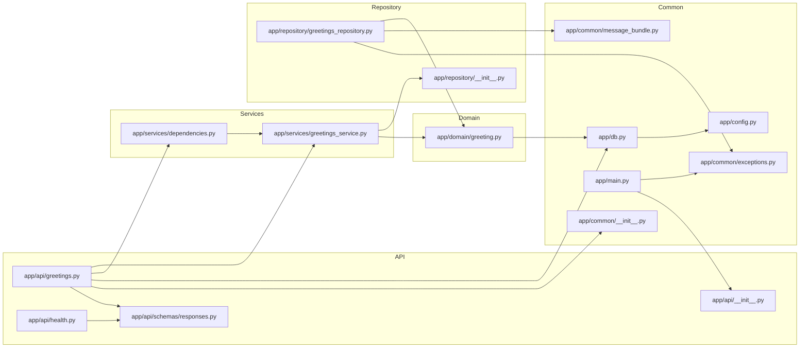
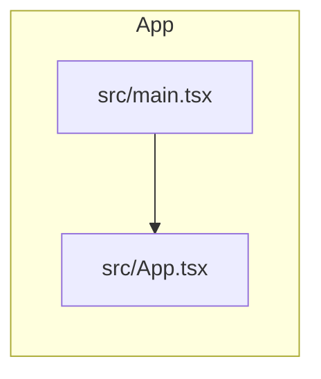

# Allocio Code Map

<!-- Generated by `tools/code_map.py --write-overview` from parsed source. Do not edit by hand. -->

Deterministic architecture overview — a module graph and a symbol outline per area, derived from Python `ast` and the TypeScript compiler. Regenerate with `uv run --python 3.14 python tools/code_map.py --write-overview docs/code-map.md`.

## Backend

### backend/alembic/versions/0001_create_greetings.py

- **fn** `downgrade` · L36–37
- **fn** `upgrade` · L20–33

### backend/app/api/greetings.py

- **route** `GET /greeting` → get_greeting · L26–32
- **fn** `get_greeting` · L26–32

### backend/app/api/health.py

- **route** `GET /health` → health · L17–19
- **fn** `health` · L17–19

### backend/app/api/schemas/responses.py

- **class** `GreetingResponse` · L5–11
- **class** `HealthResponse` · L14–17

### backend/app/common/exceptions.py

- **class** `AllocioException` · L4–5
- **class** `NotFoundError` · L8–9
- **class** `ValidationError` · L12–13

### backend/app/common/logger.py

- **fn** `critical` · L32–34
- **fn** `debug` · L7–9
- **fn** `error` · L22–24
- **fn** `exception` · L27–29
- **fn** `info` · L12–14
- **fn** `warning` · L17–19

### backend/app/config.py

- **class** `Settings` · L4–7

### backend/app/db.py

- **class** `Base` · L12–13
- **fn** `get_session` · L16–21

### backend/app/domain/greeting.py

- **class** `Greeting` · L7–13

### backend/app/main.py

- **fn** `_not_found_handler` · L15–16

### backend/app/repository/greetings_repository.py

- **fn** `get_first_greeting` · L10–15

### backend/app/services/dependencies.py

- **fn** `get_greetings_service` · L5–7

### backend/app/services/greetings_service.py

- **class** `GreetingsService` · L8–13
  - `get_first()` · L11–13

## Frontend

### frontend/src/App.tsx

- **component** `App` · L9–42

## Tooling

### tools/code_map.py

- **class** `CodeMapError` · L64–65
- **class** `DiffResult` · L398–406
- **class** `ImportChange` · L389–394
- **class** `MarkdownContext` · L410–415
- **class** `ParseError` · L68–69
- **class** `SymbolChange` · L378–385
- **class** `_Materialized` · L800–818
  - `__enter__()` · L807–814
  - `__exit__()` · L816–818
  - `__init__()` · L803–805
- **fn** `_change_from` · L459–466
- **fn** `_changed_files` · L862–864
- **fn** `_class_entry` · L273–285
- **fn** `_class_shell_hash` · L338–350
- **fn** `_classify_imports` · L447–456
- **fn** `_classify_symbols` · L435–444
- **fn** `_command_check` · L143–150
- **fn** `_command_check_overview` · L186–192
- **fn** `_command_check_staged` · L153–162
- **fn** `_command_markdown_diff` · L195–208
- **fn** `_command_markdown_staged` · L165–177
- **fn** `_command_write` · L136–140
- **fn** `_command_write_overview` · L180–183
- **fn** `_dispatch` · L99–115
- **fn** `_extract_python` · L246–270
- **fn** `_files_section` · L533–542
- **fn** `_first_string_arg` · L308–311
- **fn** `_focus_section` · L591–594
- **fn** `_frontend_area` · L357–369
- **fn** `_git` · L881–890
- **fn** `_git_show` · L893–902
- **fn** `_git_show_bytes` · L905–913
- **fn** `_has_backend_symbol_changes` · L624–625
- **fn** `_hash` · L353–354
- **fn** `_imports_section` · L565–575
- **fn** `_index_file_symbols` · L480–493
- **fn** `_index_map` · L469–477
- **fn** `_is_mapped_source` · L842–851
- **fn** `_is_test_file` · L628–629
- **fn** `_iter_changes` · L616–621
- **fn** `_layer_of` · L735–745
- **fn** `_list_index` · L858–859
- **fn** `_list_tree` · L854–855
- **fn** `_loc` · L689–694
- **fn** `_map_at_ref` · L821–823
- **fn** `_materialize_index` · L834–839
- **fn** `_materialize_ref` · L826–831
- **fn** `_merge_base` · L873–874
- **fn** `_mermaid_id` · L791–792
- **fn** `_node_hash` · L334–335
- **fn** `_overview_area` · L656–663
- **fn** `_overview_file` · L666–686
- **fn** `_overview_graph` · L697–716
- **fn** `_overview_graph_layers` · L719–732
- **fn** `_parse_args` · L118–128
- **fn** `_put` · L496–504
- **fn** `_python_area` · L234–243
- **fn** `_python_imports` · L323–331
- **fn** `_python_module_index` · L748–760
- **fn** `_read_text_or_empty` · L921–925
- **fn** `_repo_relative` · L916–918
- **fn** `_require_canonical_python` · L88–96
- **fn** `_resolve_import` · L763–766
- **fn** `_resolve_relative_import` · L769–784
- **fn** `_rev_parse` · L877–878
- **fn** `_review_focus` · L597–608
- **fn** `_routes_from_function` · L288–305
- **fn** `_routes_section` · L555–562
- **fn** `_split_range` · L867–870
- **fn** `_strip_prefix` · L787–788
- **fn** `_symbol` · L314–320
- **fn** `_symbol_line` · L611–613
- **fn** `_symbols_section` · L545–552
- **fn** `_tests_section` · L578–588
- **fn** `build_map` · L216–226
- **fn** `diff_maps` · L418–432
- **fn** `dump_map` · L229–231
- **fn** `main` · L77–85
- **fn** `render_markdown` · L512–530
- **fn** `render_overview` · L637–653

### tools/verify_pr_structural_section.py

- **fn** `_diff` · L77–89
- **fn** `_extract_block` · L68–74
- **fn** `_normalize` · L100–101
- **fn** `_parse_args` · L43–47
- **fn** `_read_expected` · L50–56
- **fn** `_read_file` · L104–106
- **fn** `_read_pr_body` · L59–65
- **fn** `_slice_markers` · L92–97
- **fn** `main` · L23–40
