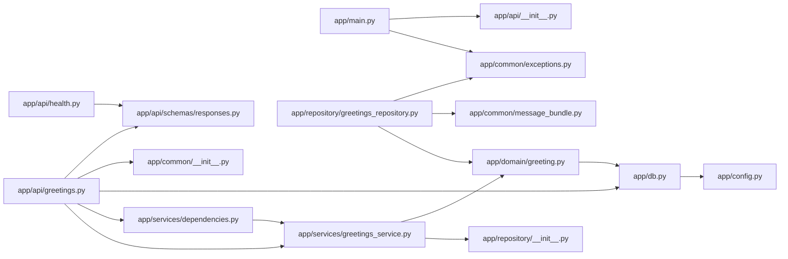
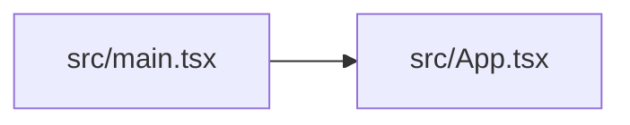

# Allocio Code Map

<!-- Generated by `tools/code_map.py --write-overview` from parsed source. Do not edit by hand. -->

Deterministic architecture overview — a module graph and a symbol outline per area, derived from Python `ast` and the TypeScript compiler. Regenerate with `uv run --python 3.14 python tools/code_map.py --write-overview docs/code-map.md`.

## Backend

### backend/alembic/versions/0001_create_greetings.py

- **fn** `downgrade` · L36–37
- **fn** `upgrade` · L20–33

### backend/app/api/greetings.py

- **route** `GET /greeting` → get_greeting · L26–32
- **fn** `get_greeting` · L26–32

### backend/app/api/health.py

- **route** `GET /health` → health · L17–19
- **fn** `health` · L17–19

### backend/app/api/schemas/responses.py

- **class** `GreetingResponse` · L5–11
- **class** `HealthResponse` · L14–17

### backend/app/common/exceptions.py

- **class** `AllocioException` · L4–5
- **class** `NotFoundError` · L8–9
- **class** `ValidationError` · L12–13

### backend/app/common/logger.py

- **fn** `critical` · L32–34
- **fn** `debug` · L7–9
- **fn** `error` · L22–24
- **fn** `exception` · L27–29
- **fn** `info` · L12–14
- **fn** `warning` · L17–19

### backend/app/config.py

- **class** `Settings` · L4–7

### backend/app/db.py

- **class** `Base` · L12–13
- **fn** `get_session` · L16–21

### backend/app/domain/greeting.py

- **class** `Greeting` · L7–13

### backend/app/main.py

- **fn** `_not_found_handler` · L15–16

### backend/app/repository/greetings_repository.py

- **fn** `get_first_greeting` · L10–15

### backend/app/services/dependencies.py

- **fn** `get_greetings_service` · L5–7

### backend/app/services/greetings_service.py

- **class** `GreetingsService` · L8–13
  - `get_first()` · L11–13

## Frontend

### frontend/src/App.tsx

- **component** `App` · L9–42

## Tooling

### tools/code_map.py

- **class** `CodeMapError` · L44–45
- **class** `DiffResult` · L378–386
- **class** `ImportChange` · L369–374
- **class** `MarkdownContext` · L390–395
- **class** `ParseError` · L48–49
- **class** `SymbolChange` · L358–365
- **class** `_Materialized` · L752–770
  - `__enter__()` · L759–766
  - `__exit__()` · L768–770
  - `__init__()` · L755–757
- **fn** `_change_from` · L439–446
- **fn** `_changed_files` · L814–816
- **fn** `_class_entry` · L253–265
- **fn** `_class_shell_hash` · L318–330
- **fn** `_classify_imports` · L427–436
- **fn** `_classify_symbols` · L415–424
- **fn** `_command_check` · L123–130
- **fn** `_command_check_overview` · L166–172
- **fn** `_command_check_staged` · L133–142
- **fn** `_command_markdown_diff` · L175–188
- **fn** `_command_markdown_staged` · L145–157
- **fn** `_command_write` · L116–120
- **fn** `_command_write_overview` · L160–163
- **fn** `_dispatch` · L79–95
- **fn** `_extract_python` · L226–250
- **fn** `_files_section` · L513–522
- **fn** `_first_string_arg` · L288–291
- **fn** `_focus_section` · L571–574
- **fn** `_frontend_area` · L337–349
- **fn** `_git` · L833–842
- **fn** `_git_show` · L845–854
- **fn** `_git_show_bytes` · L857–865
- **fn** `_has_backend_symbol_changes` · L604–605
- **fn** `_hash` · L333–334
- **fn** `_imports_section` · L545–555
- **fn** `_index_file_symbols` · L460–473
- **fn** `_index_map` · L449–457
- **fn** `_is_mapped_source` · L794–803
- **fn** `_is_test_file` · L608–609
- **fn** `_iter_changes` · L596–601
- **fn** `_list_index` · L810–811
- **fn** `_list_tree` · L806–807
- **fn** `_loc` · L669–674
- **fn** `_map_at_ref` · L773–775
- **fn** `_materialize_index` · L786–791
- **fn** `_materialize_ref` · L778–783
- **fn** `_merge_base` · L825–826
- **fn** `_mermaid_id` · L743–744
- **fn** `_node_hash` · L314–315
- **fn** `_overview_area` · L636–643
- **fn** `_overview_file` · L646–666
- **fn** `_overview_graph` · L677–697
- **fn** `_parse_args` · L98–108
- **fn** `_put` · L476–484
- **fn** `_python_area` · L214–223
- **fn** `_python_imports` · L303–311
- **fn** `_python_module_index` · L700–712
- **fn** `_read_text_or_empty` · L873–877
- **fn** `_repo_relative` · L868–870
- **fn** `_require_canonical_python` · L68–76
- **fn** `_resolve_import` · L715–718
- **fn** `_resolve_relative_import` · L721–736
- **fn** `_rev_parse` · L829–830
- **fn** `_review_focus` · L577–588
- **fn** `_routes_from_function` · L268–285
- **fn** `_routes_section` · L535–542
- **fn** `_split_range` · L819–822
- **fn** `_strip_prefix` · L739–740
- **fn** `_symbol` · L294–300
- **fn** `_symbol_line` · L591–593
- **fn** `_symbols_section` · L525–532
- **fn** `_tests_section` · L558–568
- **fn** `build_map` · L196–206
- **fn** `diff_maps` · L398–412
- **fn** `dump_map` · L209–211
- **fn** `main` · L57–65
- **fn** `render_markdown` · L492–510
- **fn** `render_overview` · L617–633

### tools/verify_pr_structural_section.py

- **fn** `_diff` · L77–89
- **fn** `_extract_block` · L68–74
- **fn** `_normalize` · L100–101
- **fn** `_parse_args` · L43–47
- **fn** `_read_expected` · L50–56
- **fn** `_read_file` · L104–106
- **fn** `_read_pr_body` · L59–65
- **fn** `_slice_markers` · L92–97
- **fn** `main` · L23–40
